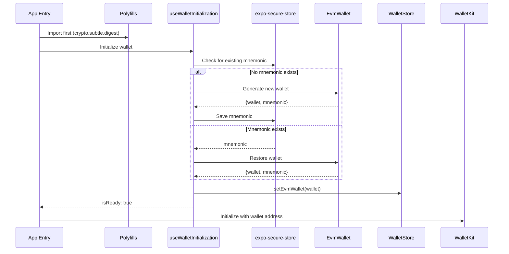
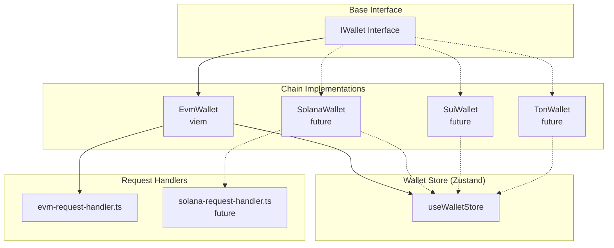
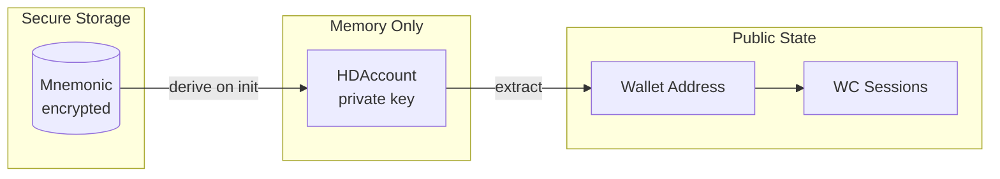

# Expo Wallet - Agent Guide

This document provides context for AI agents working on this codebase.

## Project Overview

Expo Wallet is a sample WalletConnect wallet demonstrating secure key management with a plugin-based multi-chain architecture. Built with Expo SDK 54 and React Native 0.81.

## Tech Stack

| Category | Technology |
|----------|------------|
| Framework | Expo SDK 54, React Native 0.81 |
| Language | TypeScript 5.9 (strict mode) |
| Navigation | Expo Router (file-based) |
| State | Zustand |
| Styling | React Native StyleSheet |
| Crypto | viem, react-native-quick-crypto, bip39 (patched) |
| Storage | expo-secure-store (sensitive), react-native-mmkv (non-sensitive) |
| WalletConnect | @reown/walletkit |

## Architecture

### Initialization Flow



### Plugin Architecture (Multi-Chain)



### Data Flow



## Project Structure

```
wallets/expo-wallet/
├── app/                      # Expo Router pages
│   ├── _layout.tsx          # Root layout (polyfills, init)
│   ├── (tabs)/              # Tab navigation
│   │   ├── index.tsx        # Home screen
│   │   ├── connected-apps.tsx
│   │   └── settings.tsx
│   ├── scanner.tsx          # QR code scanner
│   └── session-proposal.tsx # WC session approval modal
├── lib/                      # Core wallet logic
│   ├── base/
│   │   └── wallet-base.ts   # IWallet interface
│   └── chains/
│       └── evm/
│           ├── evm-wallet.ts           # viem wallet implementation
│           └── evm-request-handler.ts  # Signing request handlers
├── stores/                   # Zustand stores
│   ├── use-wallet-store.ts  # Wallet state
│   └── useSettingsStore.ts  # App settings
├── hooks/                    # React hooks
│   ├── use-wallet-initialization.ts  # Wallet init on startup
│   ├── use-walletkit.ts              # WalletKit hooks
│   └── use-theme-color.ts            # Theme utilities
├── utils/
│   ├── polyfills.ts         # Crypto polyfills (MUST import first)
│   ├── secure-storage.ts    # expo-secure-store wrapper
│   ├── mnemonic.ts          # BIP39 utilities
│   ├── storage.ts           # MMKV storage for WalletKit
│   └── helpers.ts           # Session/chain helpers
├── components/               # UI components
│   ├── primitives/          # Base components (Text, Button)
│   └── *.tsx                # Feature components
├── constants/
│   ├── eip155.ts            # EVM chains & signing methods
│   ├── theme.ts             # Colors, fonts
│   └── spacing.ts           # Layout constants
├── patches/
│   └── bip39+3.1.0.patch    # Native PBKDF2 for quick-crypto
└── babel.config.js          # Module aliases (crypto, buffer, stream)
```

## Conventions

### File Naming
- **Files**: `kebab-case.ts` (e.g., `evm-wallet.ts`, `use-wallet-store.ts`)
- **Components**: `kebab-case.tsx` (e.g., `scanner-frame.tsx`)
- **Hooks**: `use-*.ts` prefix

### Code Style
- **Classes**: `PascalCase` (e.g., `EvmWallet`)
- **Interfaces**: `PascalCase` with `I` prefix for contracts (e.g., `IWallet`)
- **Functions**: `camelCase` (e.g., `handleEvmRequest`)
- **Constants**: `UPPER_SNAKE_CASE` (e.g., `EIP155_SIGNING_METHODS`)
- **Types**: `PascalCase` (e.g., `WalletCreateOptions`)

### Import Aliases
```typescript
import { something } from '@/lib/...';      // ./lib/
import { something } from '@/stores/...';   // ./stores/
import { something } from '@/hooks/...';    // ./hooks/
import { something } from '@/utils/...';    // ./utils/
import { something } from '@/constants/...'; // ./constants/
import { something } from '@/components/...'; // ./components/
```

### Console Logging
Always wrap with `__DEV__` check:
```typescript
if (__DEV__) {
  console.log('Debug info:', data);
}
```

## Key Patterns

### 1. Polyfills Must Be First
```typescript
// app/_layout.tsx - CORRECT
import '@/utils/polyfills';  // MUST be first import
import { ... } from 'react';
```

### 2. Wallet Creation Returns Mnemonic Separately
```typescript
// Mnemonic is NOT stored in EvmWallet class
const { wallet, mnemonic } = EvmWallet.create();
await secureStorage.saveMnemonic(mnemonic);
// mnemonic goes out of scope, only wallet kept
```

### 3. Error Handling Pattern
```typescript
try {
  // operation
} catch (err) {
  const error = err instanceof Error ? err : new Error('Unknown error');
  console.error('Context:', error);
  // TODO: Show toast notification
}
```

### 4. WalletKit Initialization Lock
```typescript
let isInitializing = false;
// Prevents race conditions in React strict mode
if (walletKit || isInitializing) return;
isInitializing = true;
try { ... } finally { isInitializing = false; }
```

## Security Notes

### Protected Data
| Data | Storage | Notes |
|------|---------|-------|
| Mnemonic | expo-secure-store | iOS Keychain / Android Keystore |
| Private Key | Memory only | HDAccount from viem, never persisted |
| Addresses | Zustand | Public, non-sensitive |

### Disabled Methods
- `eth_sign` - Auto-rejected (phishing vector)

### Validation Points
- Mnemonic validated before wallet restoration
- WalletConnect URI validated before pairing (`wc:` prefix)
- JSON.parse wrapped in try-catch for typed data

## Common Tasks

### Adding a New Chain
1. Create `lib/chains/{chain}/{chain}-wallet.ts` implementing `IWallet`
2. Create `lib/chains/{chain}/{chain}-request-handler.ts`
3. Add chain state to `stores/use-wallet-store.ts`
4. Update `hooks/use-wallet-initialization.ts`
5. Add chain constants to `constants/`

### Adding a New Signing Method
1. Add method to `constants/eip155.ts`
2. Add case in `lib/chains/evm/evm-request-handler.ts`
3. Add method to `EvmWallet` class if needed

## Commands

```bash
npm install          # Install dependencies (runs patch-package)
npm start            # Start Expo dev server
npm run ios          # Run on iOS simulator
npm run android      # Run on Android emulator
npm run lint         # Run ESLint
npm run prettier     # Format code
```

## Dependencies to Know

- **viem**: EVM wallet operations, lighter than ethers.js
- **react-native-quick-crypto**: Native crypto (faster than JS polyfills)
- **bip39**: Mnemonic generation (patched for quick-crypto)
- **expo-secure-store**: Keychain/Keystore access
- **@reown/walletkit**: WalletConnect v2 wallet SDK
- **zustand**: Lightweight state management

## Dependency Security

When Dependabot flags security vulnerabilities in transitive dependencies, fix them by adding `overrides` to package.json, not by editing package-lock.json directly.

```json
{
  "overrides": {
    "vulnerable-package": "fixed-version"
  }
}
```

Then run `npm install` to update the lockfile.
