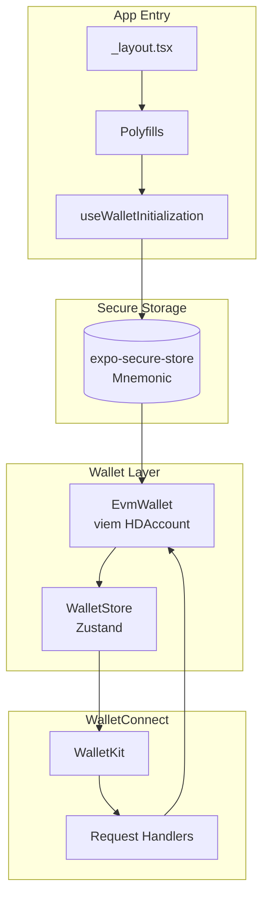

# Expo Wallet

A sample WalletConnect wallet built with Expo and React Native, demonstrating secure key management and WalletKit integration.

<p align="center">
  
  
  
  
</p>

## ✨ Features

- 🔐 **Secure Key Storage** — Mnemonic stored in iOS Keychain / Android Keystore via `expo-secure-store`
- ⚡ **Native Crypto** — Fast cryptographic operations with `react-native-quick-crypto`
- 🔗 **WalletConnect v2** — Full WalletKit integration for dApp connections
- 🏗️ **Multi-Chain Ready** — Plugin architecture for EVM (now) and Solana/Sui/TON/Tron (future)
- 📱 **QR Scanner** — Scan WalletConnect QR codes to connect

## 🚀 Quick Start

```bash
# Install dependencies
npm install

# Start the app
npx expo start

# Run on specific platform
npm run ios      # iOS Simulator
npm run android  # Android Emulator
```

## 📁 Project Structure

```
├── app/                    # Expo Router pages
│   ├── (tabs)/            # Tab navigation (home, apps, settings)
│   ├── scanner.tsx        # QR code scanner
│   └── session-proposal.tsx
├── lib/                    # Core wallet logic
│   ├── base/              # IWallet interface
│   └── chains/evm/        # EVM implementation (viem)
├── stores/                 # Zustand state management
├── hooks/                  # React hooks
├── utils/                  # Utilities (storage, crypto, helpers)
├── components/             # UI components
└── constants/              # Theme, chains, spacing
```

## 🏛️ Architecture



### Initialization Flow

1. **Polyfills loaded** — `crypto.subtle.digest` polyfilled for viem/WalletKit
2. **Wallet initialized** — Mnemonic retrieved from secure storage (or generated)
3. **WalletKit started** — Configured with wallet addresses
4. **Ready for connections** — Scan QR or paste URI to connect

## 🔒 Security

> ⚠️ **This is a sample wallet for educational purposes.**

### Data Protection

| Data            | Storage             | Protection                                  |
| --------------- | ------------------- | ------------------------------------------- |
| **Mnemonic**    | `expo-secure-store` | iOS Keychain / Android Keystore (encrypted) |
| **Private Key** | Memory only         | Never written to disk                       |
| **Addresses**   | Zustand             | Public data, non-sensitive                  |

### Security Measures

- ✅ Mnemonic validated before wallet restoration
- ✅ WalletConnect URIs validated before pairing
- ✅ `eth_sign` disabled (phishing attack vector)
- ✅ Console logs wrapped with `__DEV__` checks
- ✅ Race condition protection on WalletKit init

### Hot Wallet Limitations

This wallet keeps the private key in memory while running — standard for all hot wallets (MetaMask, Rainbow, etc.). For production:

- Consider biometric auth on app resume
- Clear sensitive data when backgrounded
- Use hardware wallets for large holdings

## 🛠️ Tech Stack

| Category      | Technology                           |
| ------------- | ------------------------------------ |
| Framework     | Expo SDK 54, React Native 0.81       |
| Language      | TypeScript 5.9 (strict)              |
| Navigation    | Expo Router                          |
| State         | Zustand                              |
| Crypto        | viem, react-native-quick-crypto      |
| Storage       | expo-secure-store, react-native-mmkv |
| WalletConnect | @reown/walletkit                     |

## 📚 Documentation

- [AGENTS.md](./AGENTS.md) — Detailed guide for developers and AI agents
- [WalletConnect Docs](https://docs.walletconnect.com/)
- [Expo Documentation](https://docs.expo.dev/)
- [viem Documentation](https://viem.sh/)

## 🗺️ Roadmap

- [x] EVM wallet (Ethereum, Polygon, Arbitrum, etc.)
- [x] Transaction signing UI
- [x] WalletConnect Pay SDK integration
- [ ] Unit tests for EvmWallet, handleEvmRequest, and utility functions
- [ ] Solana support
- [ ] Sui support
- [ ] TON support
- [ ] Tron support

## 📄 License

Part of [react-native-examples](https://github.com/reown-com/react-native-examples) by WalletConnect.
